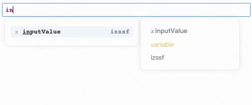

<div align="center">
   
</div>

# code-editor

a JS code editor based on codeMirror, support code autoCompletion, which can be used with [@astii/expression-sandbox](https://www.npmjs.com/package/@astii/expression-sandbox)

## Install

```typeScript
npm install @astii/code-editor --save

```

or

```typeScript
yarn add @astii/code-editor
```

## Usage

```typeScript
import React, { useState, useRef } from 'react'
import ReactDOM from 'react-dom/client'
import { CodeEditor, CodeEditorConfig } from '@astii/code-editor'
import styles from "./index.less"

const App = () => {
    const [value, setValue] = useState<string>('')
    const editorRef = useRef()
    const [completions, setCompletions] = useState([
        {
            label: "inputValue",
            detail: "izssf",
            docs: "sfsdfsf",
            properties: [
            {
                label: "a",
                detail: "asfs"
            }
            ]
        },
        {
            label: "@unction",
            docs: "sfjhbsf12424323是否会被生机勃发",
        }
    ])

    const onChange = (value) => {
        setValue(value)
    }

    const onClick = () => {
        const text = "sfsfsfs";
        editorRef.current.insertDoc(text);  //insert doc to position of cursor
        editorRef.current.getDoc();  //get doc
    };

    return (
        <div>
            <CodeEditor
                ref={editorRef}
                className={styles.wrap}
                value={value}
                completions={completions}
                onChange={onChange}
            />
            <button type="button" onClick={onClick}>
                insert
            </button>
        </div>
  );
}

const root = ReactDOM.createRoot(document.getElementById('root') as Element)
root.render(<App />)
```
